## Introduction 

The "learning facilitator" frequently describes options for lunch, as there is nothing on the WAES site about it. This information could be provided on a website instead, allowing the audience to inform themselves in advance about lunchtime options, and providing a wider range of information.

## Purpose

To inform the audience about lunchtime options.

## Target Audience

Students at WAES

## Initial Design

### Layout

#### Main page

Mobile:

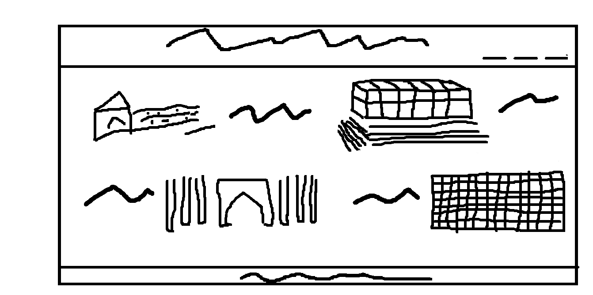

Tablet:

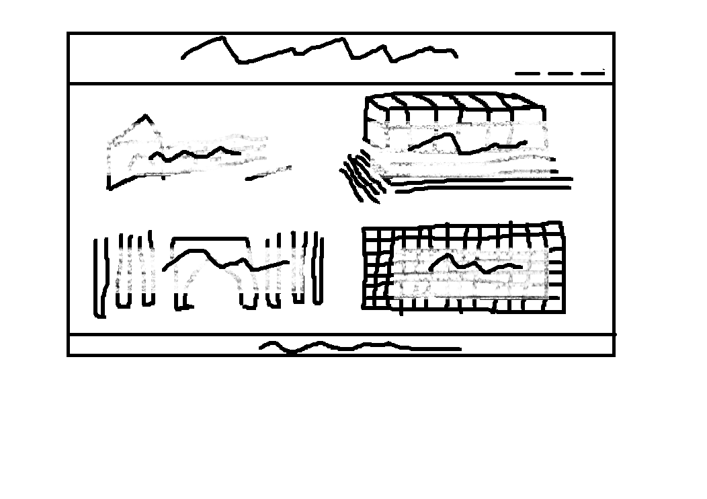

Laptop:

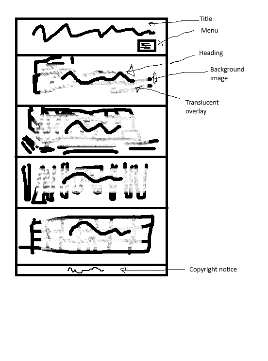

#### Location-specific page 

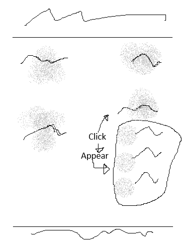

### Colours

#### Colour psychology

Green is restful, Yellow is happy

use Mycolor.Space [sic] to find a reasonable set of palette colours

test colour combinations to rule out combinations with poor contrast

#### Accessibility

Foreground colours need to have high contrast to background colours to be accessible.

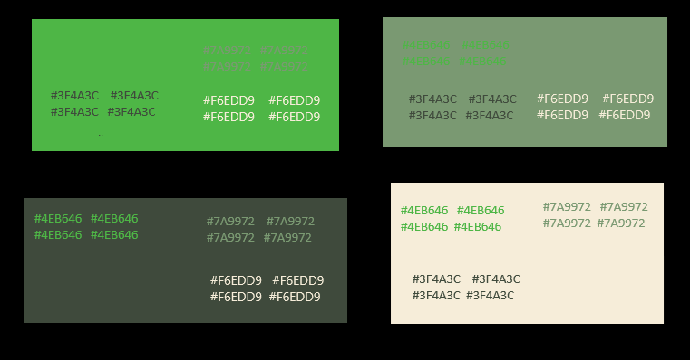

#### Final palette:

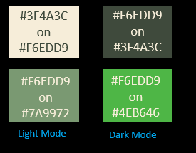

Main colours (light mode) : #3F4A3C on #F6EDD9
Secondary colours (light mode) : #F6EDD9 on #7A9972

Main colours (dark mode) : #F6EDD9 on #3F4A3C
Secondary colours (dark mode) : #F6EDD9 on #4EB646

## Features

### Lunch details

#### Site List

A list of WAES sites, each linking to a site-specific details page.

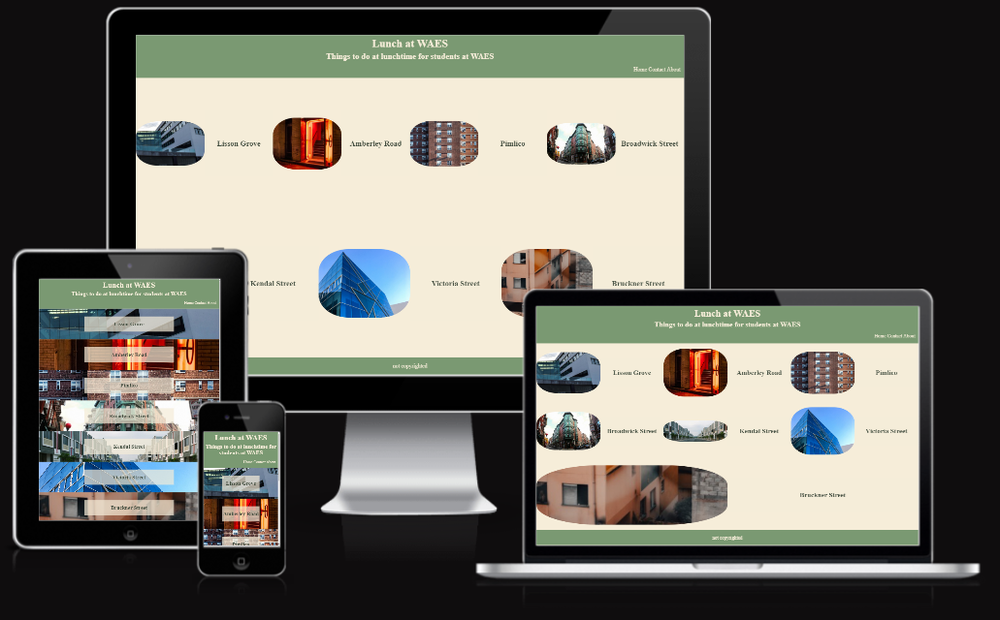

#### Site-specific Details

List of lunch options at the site which can be individually expanded to show further details.

Initial view:

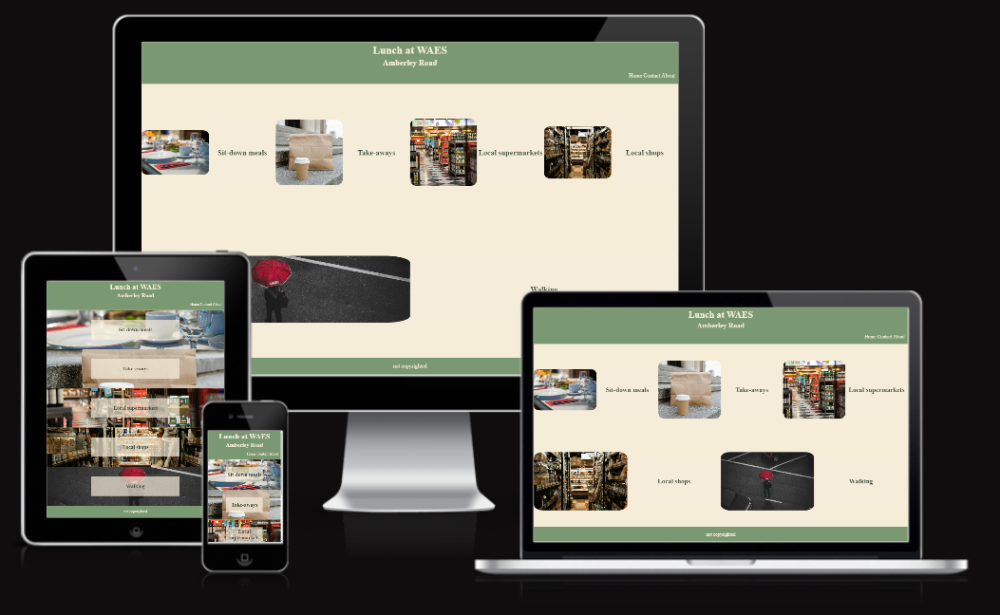

Expanding one item:

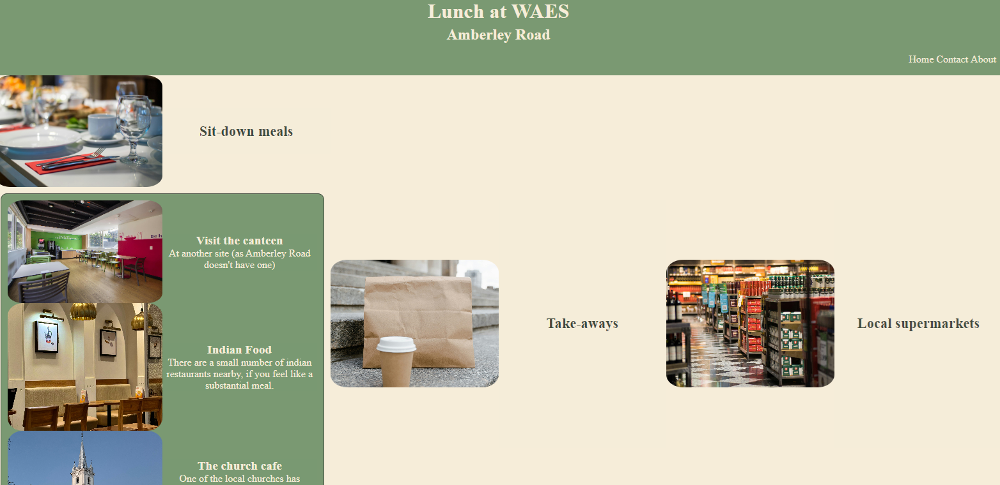

Expanding several items:

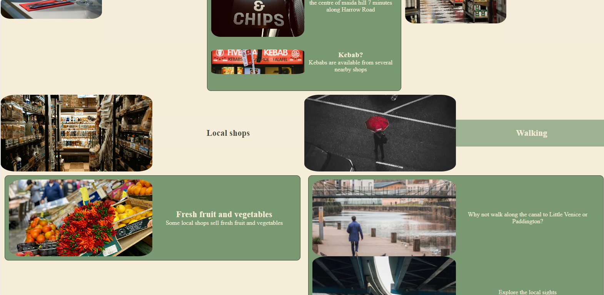

#### Placeholder

A placeholder for site pages that haven't been written yet:

Light mode:

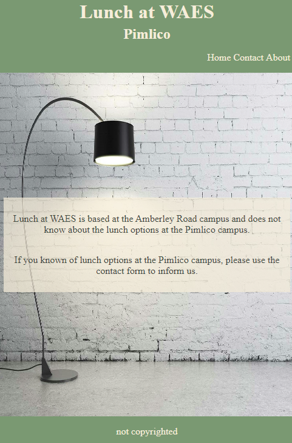

Dark mode:

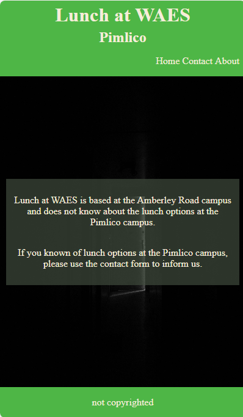

#### Contact page

A contact page for readers to submit further information (eg. about other WAES sites):

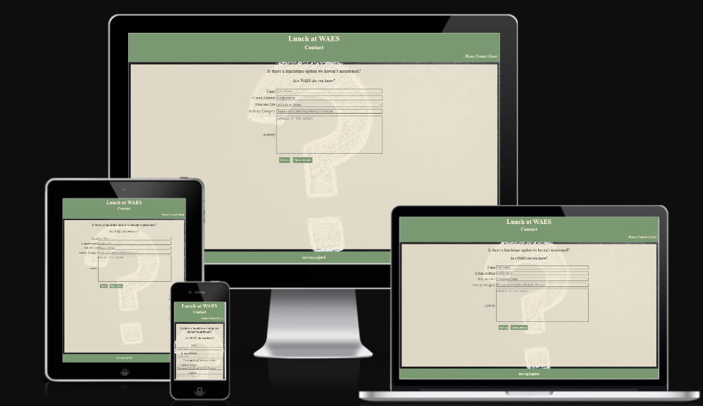

#### About page

An about page for copyright, disclaimers, and other necessary information.

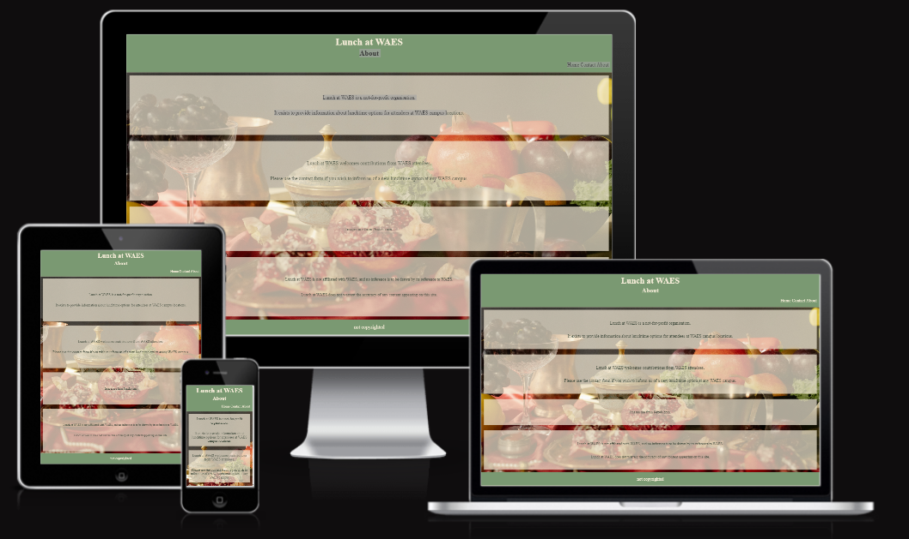

## Testing

### Initial testing

Various UI tweaks by experimentation.

### Accessibility audit

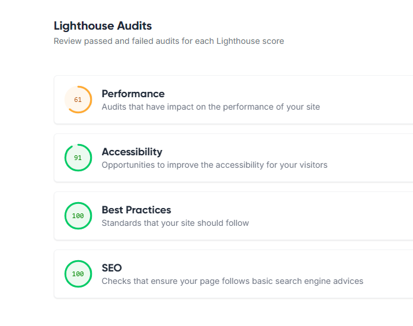

### Initial attempt at validation

#### HTML

https://w524452.github.io/Project1/index.html
-(multiple) : Element img is missing required attribute src

https://w524452.github.io/Project1/amberleyroad.html
-(multiple) : Element img is missing required attribute src
-(multiple) : Element div not allowed as child of element summary in this context. 
-(multiple) : Article lacks heading.
---between grocers and walk:
-(one instance) : Error: End tag details seen, but there were open elements.
-(one instance) : Error: Unclosed element article.
-(one instance) : Error: Stray end tag article.
-(one instance) : Section lacks heading
--sights

https://w524452.github.io/Project1/lissongrove.html
-(one instance) : Section lacks heading

https://w524452.github.io/Project1/contact.html
-no errors / warnings

https://w524452.github.io/Project1/about.html
-(multiple instances) : Section lacks heading

#### CSS

styling.css
-(multiple) : background-color from is not a valid color 3 or 6 hexadecimals numbers
-(one instance) : border-bottom-style Too many values or values are not recognized : 1px solid currentColor

locationListImagery.css
-no errors

amberleyRoadImagery.css
-no errors

### Remarks

images are loaded via CSS, not a src tag, but HTML validator still requires the src tag to be provided

The CSS validator doesn't seem to support the relative-value syntax for rgb - rgb (from ....) 

### Validation after fixing bugs and working around validator issues

#### HTML

Home Page

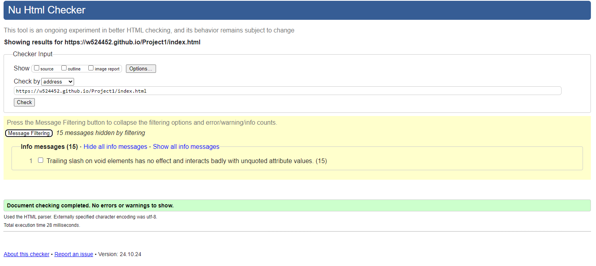

Site Details Page

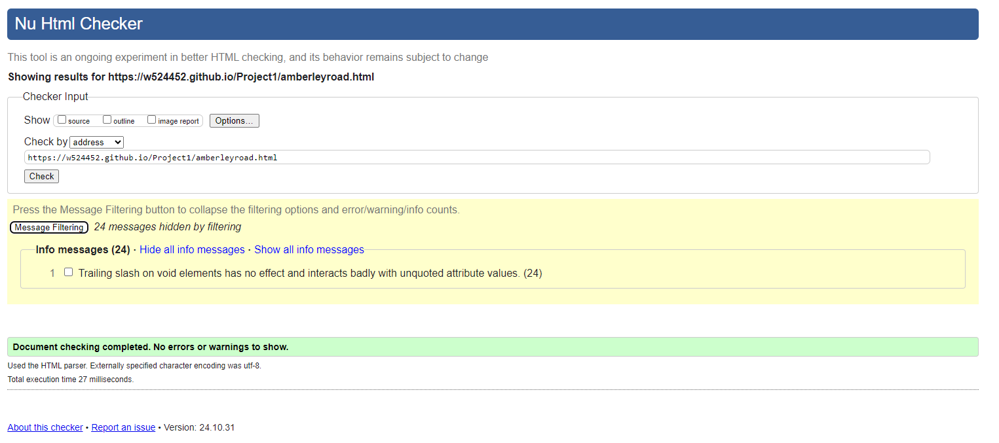

Placeholder Page

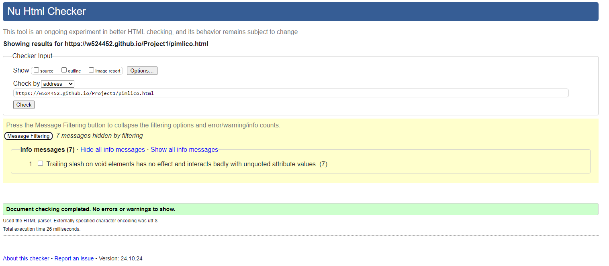

Contact Page

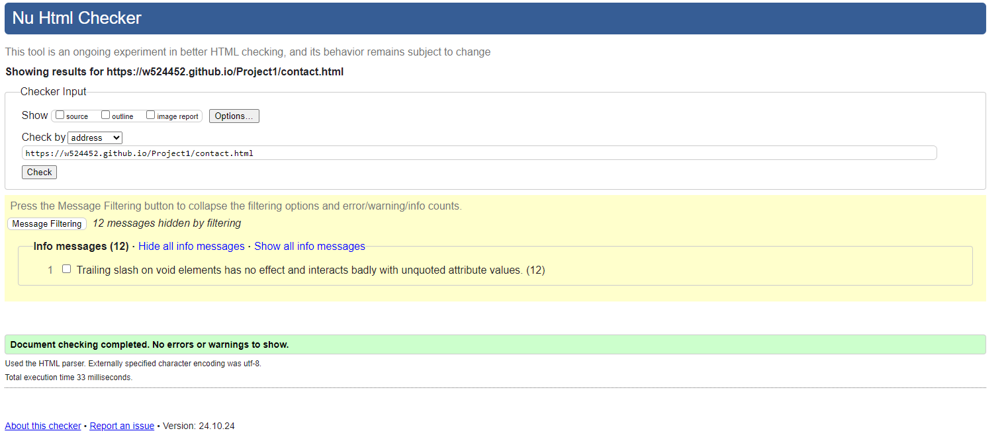

About Page

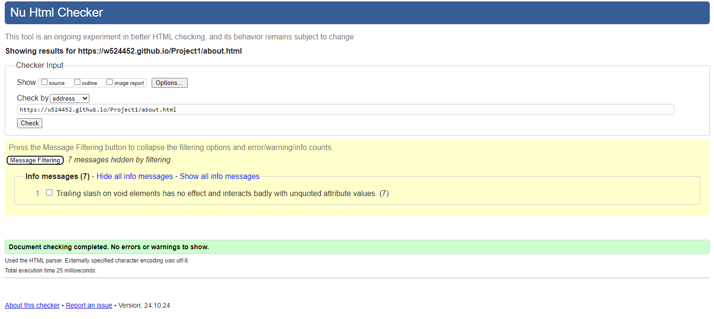

#### CSS

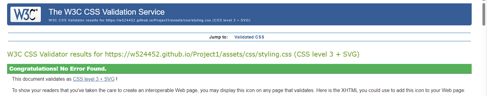

#Deployment

The site is live at [https://w524452.github.io/Project1/index.html](https://w524452.github.io/Project1/index.html)

#Attribution

Images from Pexels.com

(with certain adjustments by me)